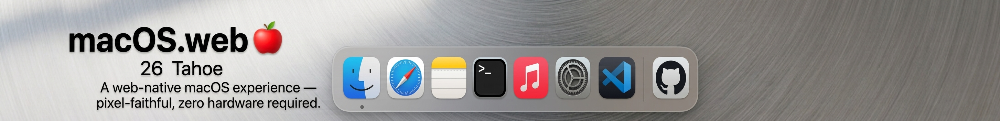
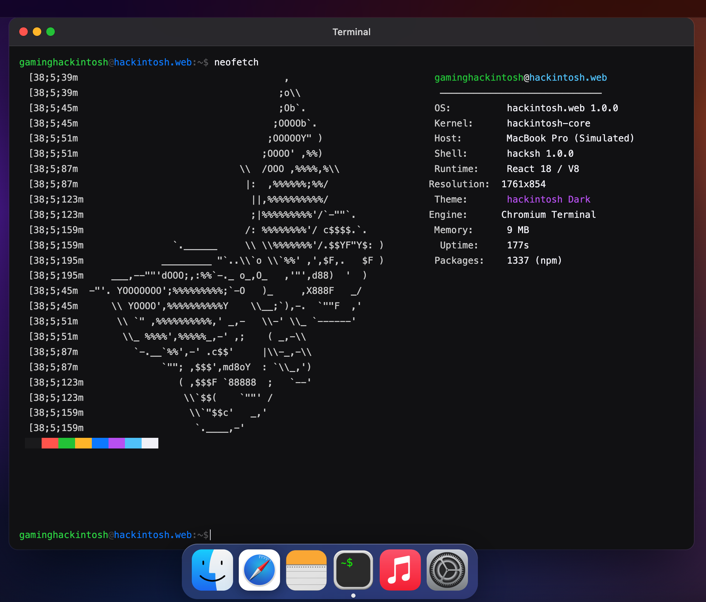

# macweb.dev 🍎

> macOS, rebuilt for the modern web.



A browser-native macOS desktop environment built with React.

No virtualization.
No installation.
No Apple hardware required.

Just open a tab and launch macOS.

---

## 🌐 Live Demo

https://gaminghackintosh.github.io/macweb.dev/

---

## 🌿 Repository Branches

| Branch      | Purpose                                      |
| ----------- | -------------------------------------------- |
| `main`      | Documentation and project overview           |
| `code-root` | Main development branch                      |
| `gh-pages`  | Production build deployed via GitHub Actions |

---

## 🏷️ Built With

[](https://react.dev)
[](https://vitejs.dev)
[](https://sass-lang.com)
[](LICENSE)
[](https://github.com/gaminghackintosh)

---

## 📖 About

**macweb.dev** is an open-source recreation of the macOS desktop experience that runs entirely in the browser.

The goal is not simply to mimic the appearance of macOS, but to reproduce the behavior and interaction patterns that make the operating system feel alive.

The project includes:

* Window management
* Native-like Finder experience
* Functional Terminal emulator
* Apple Music-inspired player
* System Settings application
* Desktop environment
* Dynamic Menu Bar
* Animated Dock
* Theme system
* Browser-based application ecosystem

All powered by modern web technologies.

|  |  |
| ------------------------------------------------------------------------------- | --------------------------------------------------------------------------------- |

---

## ✨ Features

| Feature                           | Status                    |
| --------------------------------- | ------------------------- |
| Menu Bar with live clock          | ✅ Complete                |
| Dock with spring magnification    | ✅ Complete                |
| Draggable windows                 | ✅ Complete                |
| Window resizing system            | ✅ Complete                |
| Desktop icons                     | ✅ Complete                |
| Finder file manager               | ✅ Complete                |
| Finder tabs                       | ✅ Complete                |
| Finder preview panel              | ✅ Complete                |
| Finder context menus              | ✅ Complete                |
| Terminal emulator                 | ✅ Complete                |
| Custom Terminal commands          | ✅ Complete                |
| GitHub commit history integration | ✅ Complete                |
| System Settings                   | ✅ Complete                |
| Network settings panels           | ✅ Complete                |
| Bluetooth settings panels         | ✅ Complete                |
| Display settings panels           | ✅ Complete                |
| Apple Music clone                 | ✅ Complete                |
| Waveform rendering                | ✅ Complete                |
| Notes application                 | ✅ Complete                |
| Calendar application              | ✅ Complete                |
| Wallpaper switching               | ✅ Complete                |
| Dark / Light mode                 | ✅ Complete                |
| Safari browser                    | 🟡 Functional placeholder |
| Spotlight Search (⌘ Space)        | 🔲 Planned                |
| Mission Control                   | 🔲 Planned                |
| Notification Center               | 🔲 Planned                |
| App Store                         | ❌ Not happening           |

---

## 🖥️ Applications

Current built-in applications:

* Finder
* Safari
* Notes
* Terminal
* Music
* Calendar
* System Settings

More applications are planned as the desktop ecosystem grows.

---

## 🛠 Tech Stack

### Frontend

* React 19
* Vite 5
* SCSS / SASS

### Architecture

* Context-driven state management
* Component-based window system
* Dynamic application registry
* Modular settings panels
* Custom desktop environment renderer

### UI Features

* Glassmorphism effects
* Native macOS-inspired animations
* Dock magnification physics
* Custom cursor system
* Responsive wallpaper engine
* Theme-aware components

---

## 📁 Project Structure

At this point, documenting every folder would be harder than building another application.

The repository has evolved into something closer to a miniature operating system than a traditional React project.

If you want the real source:

```bash
git clone https://github.com/gaminghackintosh/macweb.dev.git
git checkout code-root
```

Then start exploring.

Current ecosystem includes:

* Window manager
* Desktop renderer
* Dock engine
* Menu Bar system
* Finder architecture
* Terminal emulator
* Music player
* Settings framework
* Wallpaper manager
* Theme engine
* Custom cursor layer

And a few architectural decisions made after midnight.

---

## 🎮 Terminal Commands

The built-in Terminal currently supports:

| Command         | Description                     |
| --------------- | ------------------------------- |
| `help`          | Show available commands         |
| `ls`            | List directory contents         |
| `pwd`           | Print working directory         |
| `whoami`        | Display current user            |
| `uname`         | Show system information         |
| `date`          | Display current date and time   |
| `echo [text]`   | Print text                      |
| `cat readme.md` | Display README contents         |
| `figlet [text]` | Render ASCII art                |
| `neofetch`      | Display system information      |
| `git log`       | Show real GitHub commit history |
| `clear`         | Clear terminal screen           |

More commands are added as the project evolves.

---

## 🚀 Local Development

Clone the repository:

```bash
git clone https://github.com/gaminghackintosh/macweb.dev.git
```

Enter the development branch:

```bash
git checkout code-root
```

Install dependencies:

```bash
npm install
```

Start development server:

```bash
npm run dev
```

Build for production:

```bash
npm run build
```

---

## 🤝 Contributing

Contributions are welcome.

To add a new application:

1. Fork the repository
2. Create a feature branch

```bash
git checkout -b feat/my-app
```

3. Create your application
4. Register it inside the application registry
5. Submit a Pull Request

---

## 📜 License

Released under the MIT License.

---

**Made with ☕, insomnia, and an unreasonable amount of React by [@gaminghackintosh](https://github.com/gaminghackintosh)**
